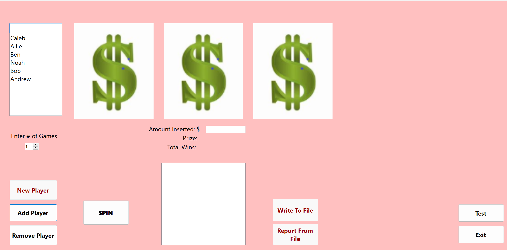

# Description
This C# program is a slot machine game that offers various functionalities. Users can add players, set their bets, and specify the number of spins they want to play. The program tracks the total number of wins and the total amount won by each player. Results are then output to a file for record-keeping.

Additionally, the program provides the option to read previous results from a file if necessary, allowing players to review their gaming history.

# Images
